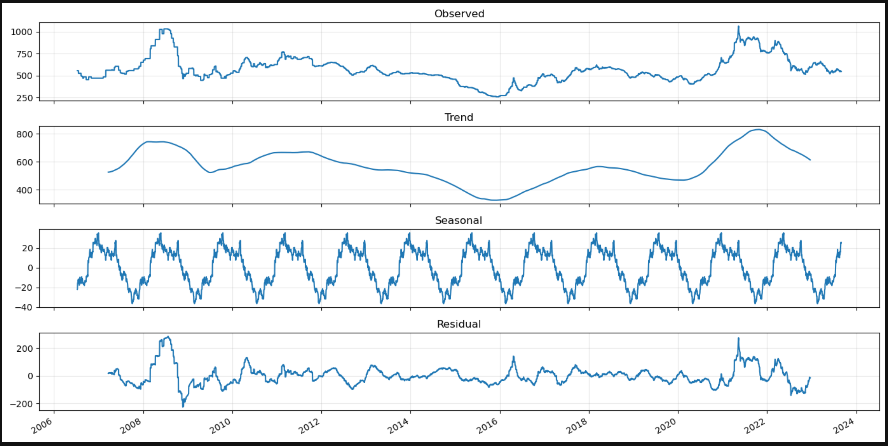
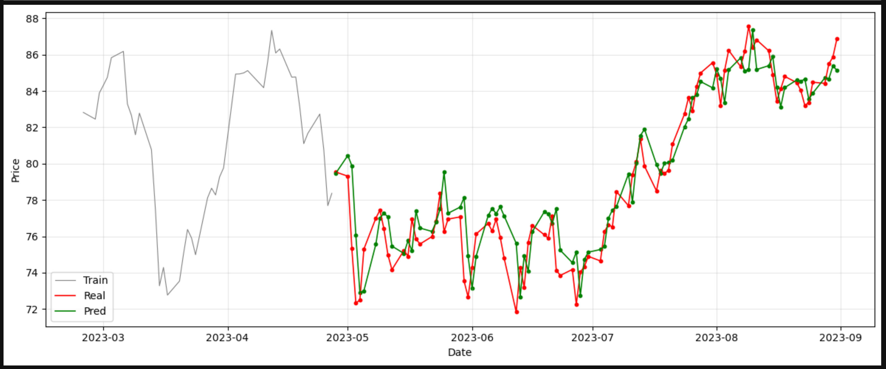

# Consultoria 1

**Purpose.** Time-series forecasting pipeline for three related datasets (X, Y, Z) with leakage-safe feature engineering, normalization, and ensemble equipo weighting.

Reference: https://towardsdatascience.com/time-series-forecasting-with-machine-learning-b3072a5b44ba/

## Quick Start

1. Clone repo and place `Consultoria 1.ipynb` at root.

```bash
!python -m pip install -r requirements.txt
```

4. Follow sections in order:
   - **Data alignment & normalization**: unify date formats, resample monthly.
   - **Leak-free feature engineering**: create lags, time features safely.
   - **Model training**: rolling/time-series folds with LightGBM.
   - **Evaluation**: MAE, decomposition, and forecasting visualization.
   - **Equipo weighting**: combine series (X, Y, Z) according to parameterized proportions.

## Requirements

- pandas
- matplotlib
- scikit-learn
- lightgbm
- statsmodels

## Notes

- Indexes must be proper `DatetimeIndex`; monthly resampling uses month-end.
- Forecast horizon is configurable (default 6).
- Ensemble weights for equipos are parameterized; adjust proportions for X, Y, Z as needed.

## Example

Modify weights and retrain:
```python
# set proportions
a, b, c = 1/3, 1/3, 1/3
# recompute equipo combination and retrain forecast
```


## Forecast Overview




*Figure: Noise dominates the seasonal component, so models that rely on strong seasonality (e.g., ARIMAX) are inappropriate.*



*Figure: Predicted vs actual values from the forecasting pipeline; used to validate model performance over the prediction horizon.*

